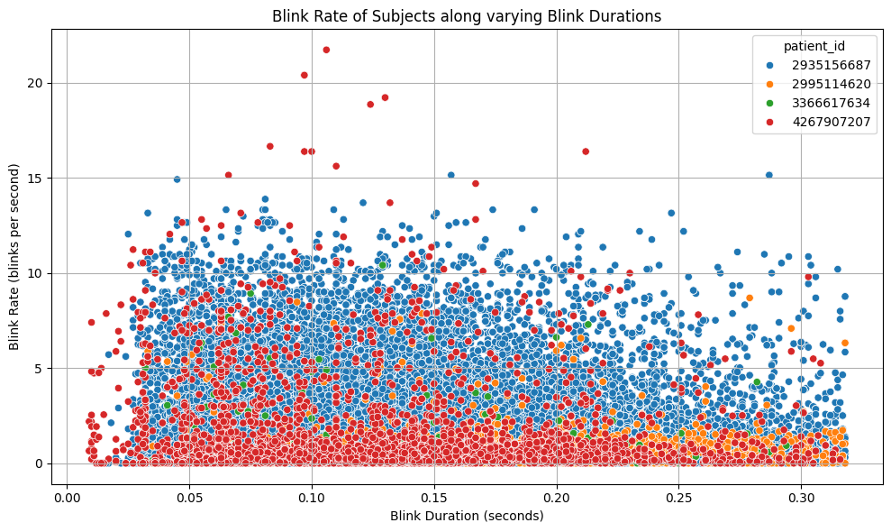

### Loading the neccessary packages


```python
import json
import os
from glob import glob
import pandas as pd
import matplotlib.pyplot as plt
from tqdm import tqdm
from datetime import datetime
import seaborn as sns
import calendar
```

### The following functions were written due to these reasons:

- **Objective**: The code was written to automate the detection and recovery of potential JSON formatting issues across multiple files and nested directory structures.
- **Use Case**: Correct JSON parsing.

#### `fix_json_file(input_file_path, output_file_path)`
- **Purpose**: This function fixes potential structural issues in a JSON file by ensuring it ends with a closing curly brace (`}`).
- **Why**: JSON files sometimes have structural issues like missing closing braces, which can cause parsing errors. This function aims to correct such issues to make the JSON valid to load.

#### `process_directory(input_dir, output_dir)`
- **Purpose**: This function processes all JSON files within a given directory (`input_dir`) and saves fixed versions of these files into an output directory (`output_dir`).
- **Why**: It allows batch processing of multiple JSON files within a directory structure. The `fix_json_file` function is utilized here to handle each JSON file individually.

#### `process_base_directory(base_dir, output_dir)`
- **Purpose**: This function processes all subfolders within a base directory (`base_dir`). For each subfolder, it calls `process_directory` to handle the JSON files within that subfolder.
- **Why**: This enables processing of nested directory structures, ensuring that all JSON files across multiple levels of folders are checked and fixed if necessary.


```python
def fix_json_file(input_file_path, output_file_path):
    """Fixes structural issues in the JSON file."""
    try:
        with open(input_file_path, 'r') as file:
            data = file.read()

            if not data.endswith('}'):
                data += '}'
                
            json_data = json.loads(data)
            
        with open(output_file_path, 'w') as fixed_file:
            json.dump(json_data, fixed_file, indent=4)
            
        # print(f"Fixed JSON file saved as: {output_file_path}")
    except json.JSONDecodeError as e:
        pass
        # print(f"Error decoding JSON in {input_file_path}: {e}")
    except Exception as e:
        print(f"An error occurred: {e}")

def process_directory(input_dir, output_dir):
    """Processes all JSON files in the directory."""

    for root, _, files in os.walk(input_dir):
        relative_path = os.path.relpath(root, input_dir)
        output_sub_dir = os.path.join(output_dir, relative_path)

        if not os.path.exists(output_sub_dir):
            os.makedirs(output_sub_dir)

        for file_name in files:
            if file_name.endswith('.json'):
                input_file_path = os.path.join(root, file_name)
                output_file_path = os.path.join(output_sub_dir, file_name)

                fix_json_file(input_file_path, output_file_path)

def process_base_directory(base_dir, output_dir):
    """Processes all subfolders in the base directory."""

    for subfolder in os.listdir(base_dir):
        input_sub_dir = os.path.join(base_dir, subfolder)
        output_sub_dir = os.path.join(output_dir, subfolder)

        if os.path.isdir(input_sub_dir):
            process_directory(input_sub_dir, output_sub_dir)

base_directory = 'data'
output_directory = 'fixed_data'
process_base_directory(base_directory, output_directory)

print("Potential JSON files with formatting errors have been reformatted!")
```

    Potential JSON files with formatting errors have been reformatted!


### Blink Data Extraction

#### `extract_blink_data(file_path)`
- This function extracts blink data from a JSON file (`file_path`) and prepares it for analysis.
- It retrieves the patient ID from the file path and reads the JSON data.
- Each blink event's timestamps (`t1` and `t2`) are processed to calculate blink durations, inter-blink durations, and blink rates.
- Invalid timestamps such as "Prompt" or "Breaktime" are ignored.
- The resulting data is formatted into a pandas DataFrame for further analysis.

#### `load_all_blink_data(base_folder)`
- This function loads blink data from all JSON files within a specified base folder (`base_folder`).
- It iterates through patient subfolders and JSON files to collect blink data using `extract_blink_data`.
- The collected data is aggregated into a pandas DataFrame that consolidates blink records across all patients and files.


```python
def extract_blink_data(file_path):
    """
    Extracts blink data from a JSON file and prepares it for analysis.
    
    Parameters:
    - file_path (str): Path to the JSON file containing blink data.
    
    Returns:
    - List of dictionaries containing blink data for each blink event.
    """
    # Extract patient id from file path
    patient_id = os.path.basename(file_path).split('_')[0]
    
    with open(file_path, 'r') as f:
        data = json.load(f)
    
    # Prepare data to load into DataFrame
    rows = []
    
    for timestamp, blink_list in data.items():
        try:
            start_timestamp_unix = datetime.strptime(timestamp, '%Y-%m-%d %H:%M:%S').timestamp()
            start_timestamp_human = datetime.strptime(timestamp, '%Y-%m-%d %H:%M:%S').strftime('%Y-%m-%d %H:%M:%S')
            
        except ValueError:
            # Intended to ignore non standard timestamps: "Prompt1" and "Breaktime"
            continue
        
        if timestamp.startswith("Prompt") or timestamp == "Breaktime":
            continue 
        
        for blink in blink_list:
            try:
                t1 = int(blink['t1'])
                t2 = int(blink['t2'])
                
                rows.append({
                    'patient_id': patient_id,
                    'timestamp_unix_epoch': int(start_timestamp_unix * 1000), 
                    'timestamp_human_readable': start_timestamp_human, 
                    't1': t1,
                    't2': t2,
                })
                
            except KeyError as e:
                print(f"Missing key {e} in file: {file_path}")
                print(f"Offending data: {blink}")
                
            except ValueError as e:
                print(f"Value error: {e} in file: {file_path}")

    df = pd.DataFrame(rows)
    
    if df.empty:
        return [] 
    
    # Remove duplicate t1 values, keeping the first occurrence
    df = df.drop_duplicates(subset=['t1'], keep='first')

    # Sort dataframe by t1 within each patient
    df_sorted = df.sort_values(by=['patient_id', 't1']).reset_index(drop=True)
    
    # Calculate inter-blink durations
    interblink_durations = []
    previous_t2 = None
    previous_patient_id = None
    
    for idx, row in df_sorted.iterrows():
        if previous_t2 is not None and row['patient_id'] == previous_patient_id:
            interblink_duration_seconds = (row['t1'] - previous_t2) / 1000.0  # Convert milliseconds to seconds
        else:
            interblink_duration_seconds = None
        
        interblink_durations.append(interblink_duration_seconds)
        
        # Update previous values
        previous_t2 = row['t2']
        previous_patient_id = row['patient_id']
    
    # blink duration in seconds
    df_sorted['blink_duration_seconds'] = (df_sorted['t2'] - df_sorted['t1']) / 1000.0
    
    df_sorted['interblink_duration_seconds'] = interblink_durations

    # blink rate in blinks per seconds
    df_sorted['blink_rate'] = 1 / df_sorted['interblink_duration_seconds']
       
    # Handle NaN inter blink durations
    df_sorted.replace({'blink_rate': [float('inf'), -float('inf')]}, None, inplace=True)
    
    return df_sorted.to_dict(orient='records')

def load_all_blink_data(base_folder):
    """
    Loads all blink data from JSON files within a base folder.
    
    Parameters:
    - base_folder (str): Path to the base folder containing patient folders with JSON files.
    
    Returns:
    - DataFrame containing all blink data across patients and files.
    """
    blink_data = []
    for patient_folder in sorted(glob(os.path.join(base_folder, '*'))):
        for file_path in sorted(glob(os.path.join(patient_folder, '*.json'))):
            blink_data.extend(extract_blink_data(file_path))
            
    return pd.DataFrame(blink_data)

base_folder = 'fixed_data'
blink_data = load_all_blink_data(base_folder)
blink_data.head()
```


<div>
<style scoped>
    .dataframe tbody tr th:only-of-type {
        vertical-align: middle;
    }

    .dataframe tbody tr th {
        vertical-align: top;
    }

    .dataframe thead th {
        text-align: right;
    }
</style>
<table border="1" class="dataframe">
  <thead>
    <tr style="text-align: right;">
      <th></th>
      <th>patient_id</th>
      <th>timestamp_unix_epoch</th>
      <th>timestamp_human_readable</th>
      <th>t1</th>
      <th>t2</th>
      <th>blink_duration_seconds</th>
      <th>interblink_duration_seconds</th>
      <th>blink_rate</th>
    </tr>
  </thead>
  <tbody>
    <tr>
      <th>0</th>
      <td>2935156687</td>
      <td>1714547058000</td>
      <td>2024-05-01 12:34:18</td>
      <td>1714547060529</td>
      <td>1714547060865</td>
      <td>0.336</td>
      <td>NaN</td>
      <td>NaN</td>
    </tr>
    <tr>
      <th>1</th>
      <td>2935156687</td>
      <td>1714547058000</td>
      <td>2024-05-01 12:34:18</td>
      <td>1714547061006</td>
      <td>1714547061089</td>
      <td>0.083</td>
      <td>0.141</td>
      <td>7.092199</td>
    </tr>
    <tr>
      <th>2</th>
      <td>2935156687</td>
      <td>1714547058000</td>
      <td>2024-05-01 12:34:18</td>
      <td>1714547067252</td>
      <td>1714547086326</td>
      <td>19.074</td>
      <td>NaN</td>
      <td>NaN</td>
    </tr>
    <tr>
      <th>3</th>
      <td>2935156687</td>
      <td>1714547145000</td>
      <td>2024-05-01 12:35:45</td>
      <td>1714547148053</td>
      <td>1714547148153</td>
      <td>0.100</td>
      <td>NaN</td>
      <td>NaN</td>
    </tr>
    <tr>
      <th>4</th>
      <td>2935156687</td>
      <td>1714547145000</td>
      <td>2024-05-01 12:35:45</td>
      <td>1714547150264</td>
      <td>1714547150419</td>
      <td>0.155</td>
      <td>2.111</td>
      <td>0.473709</td>
    </tr>
  </tbody>
</table>
</div>


```python
blink_data.describe()
```


<div>
<style scoped>
    .dataframe tbody tr th:only-of-type {
        vertical-align: middle;
    }

    .dataframe tbody tr th {
        vertical-align: top;
    }

    .dataframe thead th {
        text-align: right;
    }
</style>
<table border="1" class="dataframe">
  <thead>
    <tr style="text-align: right;">
      <th></th>
      <th>timestamp_unix_epoch</th>
      <th>t1</th>
      <th>t2</th>
      <th>blink_duration_seconds</th>
      <th>interblink_duration_seconds</th>
      <th>blink_rate</th>
    </tr>
  </thead>
  <tbody>
    <tr>
      <th>count</th>
      <td>1.009610e+05</td>
      <td>1.009610e+05</td>
      <td>1.009610e+05</td>
      <td>100961.000000</td>
      <td>92998.000000</td>
      <td>92998.000000</td>
    </tr>
    <tr>
      <th>mean</th>
      <td>1.714966e+12</td>
      <td>1.714966e+12</td>
      <td>1.714966e+12</td>
      <td>1.086568</td>
      <td>319.209613</td>
      <td>1.711910</td>
    </tr>
    <tr>
      <th>std</th>
      <td>4.247456e+08</td>
      <td>4.247665e+08</td>
      <td>4.247664e+08</td>
      <td>24.366721</td>
      <td>1975.904595</td>
      <td>2.142654</td>
    </tr>
    <tr>
      <th>min</th>
      <td>1.713207e+12</td>
      <td>1.713207e+12</td>
      <td>1.713207e+12</td>
      <td>0.000000</td>
      <td>0.046000</td>
      <td>0.000019</td>
    </tr>
    <tr>
      <th>25%</th>
      <td>1.714715e+12</td>
      <td>1.714715e+12</td>
      <td>1.714715e+12</td>
      <td>0.091000</td>
      <td>0.437000</td>
      <td>0.292826</td>
    </tr>
    <tr>
      <th>50%</th>
      <td>1.714987e+12</td>
      <td>1.714987e+12</td>
      <td>1.714987e+12</td>
      <td>0.133000</td>
      <td>1.178000</td>
      <td>0.848896</td>
    </tr>
    <tr>
      <th>75%</th>
      <td>1.715335e+12</td>
      <td>1.715335e+12</td>
      <td>1.715335e+12</td>
      <td>0.182000</td>
      <td>3.415000</td>
      <td>2.288330</td>
    </tr>
    <tr>
      <th>max</th>
      <td>1.717651e+12</td>
      <td>1.717651e+12</td>
      <td>1.717651e+12</td>
      <td>1651.868000</td>
      <td>53607.980000</td>
      <td>21.739130</td>
    </tr>
  </tbody>
</table>
</div>


### Descriptive statistics:

#### Why did I check for Non negative values `Interblink Duration`:
It ensures data quality and maintains biological plausibility, since `t1` must be greater than `t2` which helps in early error identification.


```python
print("Interblink duration statistics: \n")

negative_interblinks = blink_data[blink_data.interblink_duration_seconds < 0]
count_negative_interblinks = len(negative_interblinks)
print(f"Number of negative interblink durations: {count_negative_interblinks}")

# Count null values
null_count = blink_data.interblink_duration_seconds.isnull().sum()

# Count non-null values
non_null_count = blink_data.interblink_duration_seconds.notnull().sum()

print("Percentage of non-null values:", round(non_null_count / (null_count + non_null_count) * 100), "%")
```

    Interblink duration statistics: 
    
    Number of negative interblink durations: 0
    Percentage of non-null values: 92 %


### Handling outliers:

- To analyze blink duration outliers, I calculated the interquartile range (IQR) and defined lower and upper bounds to filter out extreme values. 
- Filtered data is visualized using a boxplot, focusing on blink durations within acceptable ranges.


```python
Q1 = blink_data['blink_duration_seconds'].quantile(0.25)
Q3 = blink_data['blink_duration_seconds'].quantile(0.75)
IQR = Q3 - Q1

# lower and upper bounds for outliers
lower_bound = Q1 - 1.5 * IQR
upper_bound = Q3 + 1.5 * IQR

# Filtering outliers
blink_duration_filtered_data = blink_data[(blink_data['blink_duration_seconds'] >= lower_bound) & (blink_data['blink_duration_seconds'] <= upper_bound)]

plt.figure(figsize=(10, 6))
sns.boxplot(x='blink_duration_seconds', data=blink_duration_filtered_data, color='lightblue')
plt.title('Boxplot of Blink Duration After Removing Outliers')
plt.xlabel('Blink Duration (seconds)')
plt.grid(True)
plt.show()
```


    

    


```python
Q1 = blink_data['interblink_duration_seconds'].quantile(0.25)
Q3 = blink_data['interblink_duration_seconds'].quantile(0.75)
IQR = Q3 - Q1

lower_bound = Q1 - 1.5 * IQR
upper_bound = Q3 + 1.5 * IQR

interblink_duration_filtered_data = blink_data[(blink_data['interblink_duration_seconds'] >= lower_bound) & (blink_data['interblink_duration_seconds'] <= upper_bound)]

plt.figure(figsize=(10, 6))
sns.boxplot(x='interblink_duration_seconds', data=interblink_duration_filtered_data, color='lightblue')
plt.title('Boxplot of InterBlink Duration After Removing Outliers')
plt.xlabel('InterBlink Duration (seconds)')
plt.grid(True)
plt.show()
```


    

    


### Categorizing Interblink Intervals:

Bar plot to illustrate the difference in blink rates between intervals less than 25 seconds and those 25 seconds or more.


```python
# Ensure interblink_duration is not None and in seconds
filtered_blinks = blink_data.dropna(subset=['interblink_duration_seconds'])

# Add interval column: 0 - within 25 seconds, 1 - beyond 25 seconds
filtered_blinks['interval'] = (filtered_blinks['interblink_duration_seconds'] >= 25).astype(int)

plt.figure(figsize=(12, 8))
sns.barplot(x='interval', y='blink_rate', data=filtered_blinks, errorbar=None, legend=False)
plt.xlabel('Interval')
plt.ylabel('Blink Rate (blinks per second)')
plt.title('Blink Rate by Interval')
plt.xticks([0, 1], ['< 25 sec', '>= 25 sec'])
plt.grid(True)
plt.tight_layout()
plt.show()
```

    /var/folders/6x/c19tq81j2954h_g4n73r3lp40000gn/T/ipykernel_2673/1148524323.py:5: SettingWithCopyWarning: 
    A value is trying to be set on a copy of a slice from a DataFrame.
    Try using .loc[row_indexer,col_indexer] = value instead
    
    See the caveats in the documentation: https://pandas.pydata.org/pandas-docs/stable/user_guide/indexing.html#returning-a-view-versus-a-copy
      filtered_blinks['interval'] = (filtered_blinks['interblink_duration_seconds'] >= 25).astype(int)


    

    


### KDE Plot of Blink Rate:

- KDE plot is generated to analyze the distribution and density of `blink rates` in the dataset. 
- It helps to identify patterns or clusters in blink rate frequencies, aiding in the exploration of the studied population.


```python
plt.figure(figsize=(12, 8))
sns.kdeplot(filtered_blinks['blink_rate'], fill=True, color='red')
plt.xlabel('Blink Rate (blinks per second)')
plt.ylabel('Density')
plt.title('KDE Plot of Blink Rate')
plt.grid(True)
plt.tight_layout()
plt.show()

```


    

    


### KDE plot of Interblink Durations:

By examining this plot, insights can be gained into the variability and frequency of pauses between blinks, contributing to blinking patterns and behavior among the subjects.


```python
# KDE plot of interblink durations
plt.figure(figsize=(12, 8))
sns.kdeplot(interblink_duration_filtered_data['interblink_duration_seconds'], fill=True, color='red')
plt.xlabel('Interblink Duration (in seconds)')
plt.ylabel('Density')
plt.title('KDE Plot of Interblink Duration')
plt.grid(True)
plt.tight_layout()
plt.show()
```


    

    


### Distribution of Blink Durations:

By examining this plot, one can observe: <br>
a) central tendency <br>
b) variability, and <br>
c) shape of the blink duration distribution <br>
which aids in understanding the typical duration of blinks and any patterns or outliers present in the data.


```python
plt.figure(figsize=(12, 8))
sns.histplot(blink_duration_filtered_data['blink_duration_seconds'], bins=30, kde=True, color='blue')
plt.xlabel('Blink Duration (seconds)')
plt.ylabel('Frequency')
plt.title('Distribution of Blink Duration')
plt.grid(True)
plt.tight_layout()
plt.show()
```


    

    


### Distribution of Interblink Duration:
This histogram illustrates the distribution of interblink durations among the filtered blink data. Interblink duration refers to the time interval between successive blinks, measured in seconds. <br>

This analysis is crucial for quantitative insights into: <br>
a) How often individuals blink and <br>
b) Variability in their blink rates over time.


```python
plt.figure(figsize=(12, 8))
sns.histplot(interblink_duration_filtered_data['interblink_duration_seconds'], bins=30, kde=True, color='blue')
plt.xlabel('InterBlink Duration (seconds)')
plt.ylabel('Frequency')
plt.title('Distribution of InterBlink Duration')
plt.grid(True)
plt.tight_layout()

plt.show()
```


    

    


### Blink Rate of Subjects along Varying Blink Durations:

- Each point represents a combination of blink duration and blink rate for a specific subject. 
- The plot shows how blink duration relates to blink rate variability among individuals


```python
plt.figure(figsize=(10, 6))
sns.scatterplot(data=blink_duration_filtered_data, x='blink_duration_seconds', y='blink_rate', hue='patient_id')
plt.xlabel('Blink Duration (seconds)')
plt.ylabel('Blink Rate (blinks per second)')
plt.title('Blink Rate of Subjects along varying Blink Durations')
plt.grid(True)
plt.tight_layout()
plt.show()
```


    

    


### Case study: Analysis of Blink Rate Patterns Across Months
### How blink rate is affected in different months?

This analysis explores how blink rates vary across different months, aiming to:

1. Identify any seasonal or temporal patterns in blinking behavior. 
2. By plotting and examining blink rates over monthly intervals, this investigation provides insights into potential influences of external factors and conditions on blink frequency. 

Aim: Preliminary analysis to help aid for strategies for eye care and well-being management


```python
# Convert 'timestamp' to datetime
blink_data['timestamp_human_readable'] = pd.to_datetime(blink_data['timestamp_human_readable'])

# Extract month from 'timestamp'
blink_data['month'] = blink_data['timestamp_human_readable'].dt.month
blink_data
```


<div>
<style scoped>
    .dataframe tbody tr th:only-of-type {
        vertical-align: middle;
    }

    .dataframe tbody tr th {
        vertical-align: top;
    }

    .dataframe thead th {
        text-align: right;
    }
</style>
<table border="1" class="dataframe">
  <thead>
    <tr style="text-align: right;">
      <th></th>
      <th>patient_id</th>
      <th>timestamp_unix_epoch</th>
      <th>timestamp_human_readable</th>
      <th>t1</th>
      <th>t2</th>
      <th>blink_duration_seconds</th>
      <th>interblink_duration_seconds</th>
      <th>blink_rate</th>
      <th>month</th>
    </tr>
  </thead>
  <tbody>
    <tr>
      <th>0</th>
      <td>2935156687</td>
      <td>1714547058000</td>
      <td>2024-05-01 12:34:18</td>
      <td>1714547060529</td>
      <td>1714547060865</td>
      <td>0.336</td>
      <td>NaN</td>
      <td>NaN</td>
      <td>5</td>
    </tr>
    <tr>
      <th>1</th>
      <td>2935156687</td>
      <td>1714547058000</td>
      <td>2024-05-01 12:34:18</td>
      <td>1714547061006</td>
      <td>1714547061089</td>
      <td>0.083</td>
      <td>0.141</td>
      <td>7.092199</td>
      <td>5</td>
    </tr>
    <tr>
      <th>2</th>
      <td>2935156687</td>
      <td>1714547058000</td>
      <td>2024-05-01 12:34:18</td>
      <td>1714547067252</td>
      <td>1714547086326</td>
      <td>19.074</td>
      <td>NaN</td>
      <td>NaN</td>
      <td>5</td>
    </tr>
    <tr>
      <th>3</th>
      <td>2935156687</td>
      <td>1714547145000</td>
      <td>2024-05-01 12:35:45</td>
      <td>1714547148053</td>
      <td>1714547148153</td>
      <td>0.100</td>
      <td>NaN</td>
      <td>NaN</td>
      <td>5</td>
    </tr>
    <tr>
      <th>4</th>
      <td>2935156687</td>
      <td>1714547145000</td>
      <td>2024-05-01 12:35:45</td>
      <td>1714547150264</td>
      <td>1714547150419</td>
      <td>0.155</td>
      <td>2.111</td>
      <td>0.473709</td>
      <td>5</td>
    </tr>
    <tr>
      <th>...</th>
      <td>...</td>
      <td>...</td>
      <td>...</td>
      <td>...</td>
      <td>...</td>
      <td>...</td>
      <td>...</td>
      <td>...</td>
      <td>...</td>
    </tr>
    <tr>
      <th>100956</th>
      <td>4267907207</td>
      <td>1714454360000</td>
      <td>2024-04-30 10:49:20</td>
      <td>1714454362457</td>
      <td>1714454369039</td>
      <td>6.582</td>
      <td>NaN</td>
      <td>NaN</td>
      <td>4</td>
    </tr>
    <tr>
      <th>100957</th>
      <td>4267907207</td>
      <td>1714454360000</td>
      <td>2024-04-30 10:49:20</td>
      <td>1714454369089</td>
      <td>1714454369562</td>
      <td>0.473</td>
      <td>NaN</td>
      <td>NaN</td>
      <td>4</td>
    </tr>
    <tr>
      <th>100958</th>
      <td>4267907207</td>
      <td>1717048316000</td>
      <td>2024-05-30 11:21:56</td>
      <td>1717048322604</td>
      <td>1717048322720</td>
      <td>0.116</td>
      <td>NaN</td>
      <td>NaN</td>
      <td>5</td>
    </tr>
    <tr>
      <th>100959</th>
      <td>4267907207</td>
      <td>1717134255000</td>
      <td>2024-05-31 11:14:15</td>
      <td>1717134263863</td>
      <td>1717134263969</td>
      <td>0.106</td>
      <td>NaN</td>
      <td>NaN</td>
      <td>5</td>
    </tr>
    <tr>
      <th>100960</th>
      <td>4267907207</td>
      <td>1717134255000</td>
      <td>2024-05-31 11:14:15</td>
      <td>1717134274713</td>
      <td>1717134274846</td>
      <td>0.133</td>
      <td>10.744</td>
      <td>0.093075</td>
      <td>5</td>
    </tr>
  </tbody>
</table>
<p>100961 rows × 9 columns</p>
</div>


```python
# Count the number of records per month
record_counts = blink_data['month'].value_counts().reset_index()
record_counts.columns = ['month', 'count']
record_counts = record_counts.sort_values(by='month')

monthly_blink_rate = blink_data.groupby('month')['blink_rate'].mean().reset_index()

# Map month numbers to names
month_map = {1: 'January', 2: 'February', 3: 'March', 4: 'April', 5: 'May', 6: 'June', 
             7: 'July', 8: 'August', 9: 'September', 10: 'October', 11: 'November', 12: 'December'}

record_counts['month_name'] = record_counts['month'].map(month_map)
monthly_blink_rate['month_name'] = monthly_blink_rate['month'].map(month_map)

print(record_counts)
print(monthly_blink_rate)
```

       month  count month_name
    1      4   6288      April
    0      5  94624        May
    2      6     49       June
       month  blink_rate month_name
    0      4    1.245331      April
    1      5    1.732540        May
    2      6    3.234829       June


```python
combined_data = pd.merge(record_counts, monthly_blink_rate, on='month')
combined_data['month_name'] = combined_data['month'].apply(lambda x: calendar.month_name[x])

fig, ax1 = plt.subplots(figsize=(14, 7))

# Plot the number of records in log scale
color = 'tab:blue'
ax1.set_xlabel('Month')
ax1.set_ylabel('Number of Observations (log scale)', color=color)
ax1.set_yscale('log')  # Set y-axis to logarithmic scale
sns.barplot(data=combined_data, x='month_name', y='count', ax=ax1, palette='viridis', alpha=0.6)
ax1.tick_params(axis='y', labelcolor=color)

# Plot the blink rate on the same x-axis but different y-axis
ax2 = ax1.twinx()
color = 'tab:red'
ax2.set_ylabel('Average Blink Rate (blinks per second)', color=color)
sns.lineplot(data=combined_data, x='month_name', y='blink_rate', ax=ax2, color=color, marker='o')
ax2.tick_params(axis='y', labelcolor=color)

# Annotate each point on the line plot with the month name
for index, row in combined_data.iterrows():
    ax2.text(row['month_name'], row['blink_rate'], row['month_name'], ha='center', va='bottom', fontsize=9, color='black')

plt.title('Relation between Blink Rates and Months, while also considering Number of Observations')
fig.tight_layout()
plt.show()
```

    /var/folders/6x/c19tq81j2954h_g4n73r3lp40000gn/T/ipykernel_2673/2424305985.py:11: FutureWarning: 
    
    Passing `palette` without assigning `hue` is deprecated and will be removed in v0.14.0. Assign the `x` variable to `hue` and set `legend=False` for the same effect.
    
      sns.barplot(data=combined_data, x='month_name', y='count', ax=ax1, palette='viridis', alpha=0.6)


    

    


1. **Monthly Record Counts**: 
   - In May, the number of records is significantly higher compared to April and June.
   - April has the lowest count of records among the three months.

2. **Monthly Blink Rates**:
   - June shows the highest average blink rate, followed by May and April.
   - There appears to be an increasing trend in blink rates from April to June.

**Conclusion:**
- May had the highest number of recorded instances, indicating possibly more data collection during that month.
- June exhibited the highest average blink rate, suggesting potential variations in blinking behavior across different months.

### Thank you for going through the notebook!


